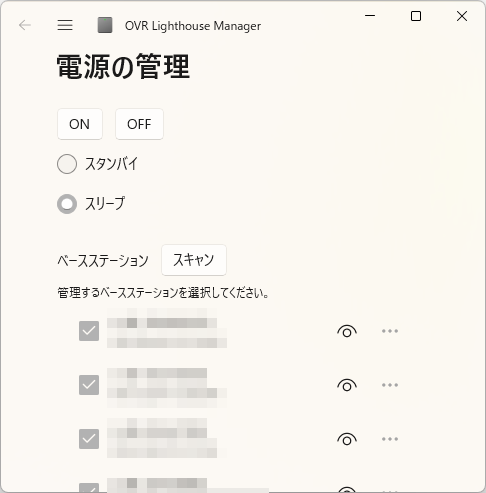

# OVR Lighthouse Manager Manual

## Introduction

クロツ様が公開されている[OVR Lighthouse Manager](https://kurotu.booth.pm/items/5315515)に次の変更を加えたものです

- ソフトウェアを起動したら即座に全てのBaseStationをONにします
- ON/OFFボタンを押すと全てのBaseStateionを一斉にON/OFFします
- 既存のVR連携機能（VR起動終了と連動したBaseStationSW機能）はありません

## How to Use

- クローンしてください
- ビルドして実行してください
- 操作・機能は基本的にオリジナル同様で、変更点は上記のとおりです。

## License

[GPLv3](./LICENSE)

## Contact

- X: [@pandra_gmk](https://x.com/pandra_gmk)